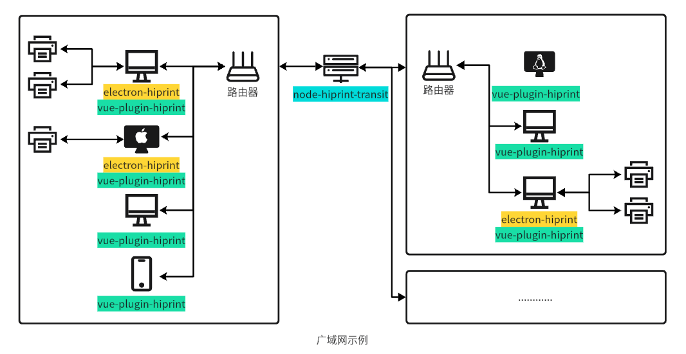
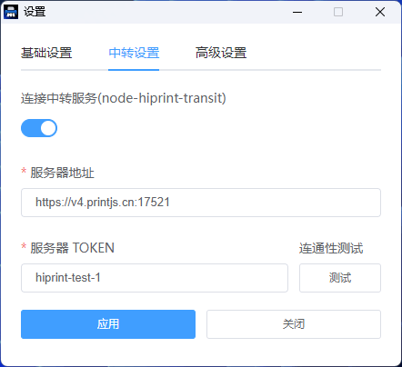
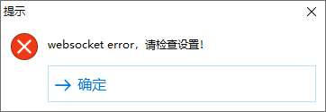
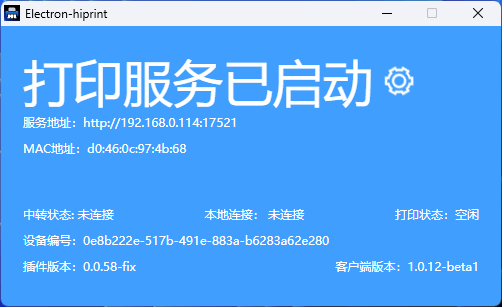

<a name="readme-top"></a>

# node-hiprint-transit

`node-hiprint-transit` 是一个基于 Node.js 的中转服务器，用于在 `electron-hiprint` 客户端和 `vue-plugin-hiprint` 库之间充当中转服务，实现这些组件之间的无缝连接和打印操作。

[](https://deepwiki.com/Xavier9896/node-hiprint-transit)



## 特点

- **远程打印**: 使用 `electron-hiprint` 轻松将模板打印到打印机，无需弹出对话框。

- **安全连接**: 客户端、中转服务器和 `vue-plugin-hiprint` 之间的所有连接都使用令牌进行安全保护。

- **配置**: `node-hiprint-transit` 允许您配置各种设置，包括端口、令牌、是否使用 SSL 和语言首选项。

- **易用性**: `node-hiprint-transit` 一般安装在公网服务器，服务器 ip、端口 相对固定，也可通过域名访问，`electron-hiprint` 和 `vue-plugin-hiprint` 中只需配置一次地址，不像 `electron-hiprint` 一样容易受到 DHCP 自动分配变更地址。

<a href="#success_note">↓ ⚠️ 重要提示</a>

## 免费服务-用爱发电

| 版本    | 服务器信息     | 服务商        | 地域 | 有效期        | 服务器地址                         | Token              |
|-------| -------------- | ------------- | ---- |------------|-------------------------------| ------------------ |
| 0.0.5 | 2C2G4M 300G/m  | Tencent Cloud | GZ   | 2026-07-16 | https://v5.printjs.cn:17521   | hiprint\*          |
| 0.0.3 | 1C1G3M 1000G/m | Yisu Cloud    | HK   | 2025-07-17 | https://printjs.cn:17521      | vue-plugin-hiprint |

以上服务免费开放，0.0.3 版本未进行 token 隔离，仅推荐用于开发测试。

本项目免费开源，承诺不会窃取以上免费服务运行中产生的任何数据，但不能保证服务过程中不会受到黑客攻击而导致数据泄露问题。

如果你的服务追求更高的 **稳定性、安全性、可靠性**，建议自行独立部署，有自研能力的团队可以使用后端语言重新编写。

> [!IMPORTANT]
> !!! ⚠️ v4-b.printjs.cn:17521,v5-b.printjs.cn:17521 服务因长期闲置，即日起已停止服务并释放。0.0.3 版本 printjs.cn:17521 服务器将在到期后释放。

> [!IMPORTANT]
> !!! ⚠️ 在 web 端使用时请做到即用即走，不要长时间连接该服务，为服务器减轻压力。

> [!IMPORTANT]
> !!! ⚠️ 请勿使用弱口令，如 “hiprint-123”，因使用弱口令导致的任何问题，本项目概不负责。

> [!NOTE]
>
> > **！本人纯前端，对于服务器、运维、攻防了解较少，请各位大佬高抬贵手，不要对免费开源服务下手**

## linux 一键安装脚本

这个脚本将帮助你快速安装、初始化、运行 `node-hiprint-transit`。

```bash
wget https://raw.githubusercontent.com/Xavier9896/node-hiprint-transit/main/install.sh

chmod +x install.sh

./install.sh
```

## 🐳 使用 Docker 启动项目

### 1. 克隆项目

```bash
git clone https://github.com/Xavier9896/node-hiprint-transit.git
cd node-hiprint-transit
```

### 2. 启动服务
```bash
docker-compose up -d
```

## Window 系统启动项目
### 1. 下载打包文件
[点击下载](https://gitee.com/Xavier9896/node-hiprint-transit/blob/main/out/transit-setup-0.0.5.exe)

### 2. 指定解压缩路径
### 3. 运行 `start.bat` 脚本

## 初始化设置

首次使用时，您需要执行初始设置

这将会引导你一步步完成初始化

```bash
node run ./dist/init

# ? Set language 设置语言 (Use arrow keys)
# > English
#   简体中文
# ? 设置服务端口号 10000~65535： 17521
# ? 设置服务 TOKEN （使用通配符(*)匹配任意字符）：hiprint*
# ? 使用 SSL：(y/N)
# 配置文件写入成功
```

如果你的配置有误或需要调整，只需要重新执行一次脚本即可。

## 配置

配置向导将提示您设置以下选项：

- **语言**: 选择您的首选语言（默认：English）。

- **端口**: 通信使用的端口号（默认：17521）。

- **令牌**: 用于身份验证的安全令牌（6 个或更多字符，可使用一个或多个 \* 作为通配符）（默认：hiiprint）。

- **SSL**: 启用或禁用安全连接的 SSL（默认：false）。

<p align="right"><a href="#readme-top">↑ 回到顶部</a></p>

## 使用方法

### 启动服务

```bash
node ./dist/index

服务器正运行在
https://v5.printjs.cn:17521

请确保安全组或防火墙已放行端口。
令牌：hiprint*
```

### `Web` 项目连接 `node-hiprint-transit`

现在你可以直接使用服务器地址及token连接中转服务 `node-hiprint-transit`

```javascript
import { hiprint } from 'vue-plugin-hiprint';

hiprint.init({
  host: 'https://v5.printjs.cn:17521', // 此处输入服务启动后的地址
  token: 'hiprint-test-1', // 用于鉴权的token
});
```

<p align="right"><a href="#readme-top">↑ 回到顶部</a></p>

### `electron-hiprint` 连接到 `node-hiprint-transit`

右键单击托盘图标以访问设置并输入服务器地址、端口和令牌。



输入完毕后你可以点击 `测试` 检查是否能够正常连接。

> 连接成功


> 连接失败



最后 `应用` 重启即可



<p align="right"><a href="#readme-top">↑ 回到顶部</a></p>

## EVENTS

当 Web 客户端（vue-plugin-hiprint）连接时，将发出 `serverInfo`、 `clients` 和 `printerList` 事件。

### socket.emit("serverInfo", Object) ↑ v0.0.4

这将返回中转服务端的一些信息

```js
{
  // 中转服务版本号
  version: "0.0.5",
  // 当前 TOKEN 连接的客户端数量
  currentClients: 1,
  // 所有连接的客户端数量
  allClients: 1
  // 当前 TOKEN 连接的网页数量
  webClients: 1,
  // 所有连接的网页数量
  allWebClients: 1,
  // 服务器总内存
  totalmem: 2147483648,
  // 服务器空闲内存
  freemem: 1073741824,
}
```

### socket.on("getClients")

### socket.emit("clients", Object)

这将显示所有连接的 `electron-hiprint` 客户端的信息。

```js
{
  "AlBaUCNs3AIMFPLZAAAh": {
    arch: "x64",
    clientUrl: "http://192.168.0.2:17521",
    ip: "192.168.0.2",
    ipv6: "fe80::13f:eb0f:e426:7c92",
    mac: "a1:a2:a3:a4:a5:a6",
    machineId: "12c90ff9-b9f4-4178-9099-9dd326b70c2e",
    platform: "win32",
    printerList: (6) [{
      description: "",
      displayName: "Microsoft Print to PDF",
      isDefault: true,
      name: "Microsoft Print to PDF",
      options: {,
        "printer-location": "",
        "printer-make-and-model": "Microsoft Print To PDF",
        "system_driverinfo": "Microsoft Print To PDF;10.0.19041.3570 (WinBuild.160101.0800);Microsoft® Windows® Operating System;10.0.19041.3570"
      },
      status: 0
    }, {…}, {…}, {…}, {…}, {…}],
    version: "1.0.7",
  },
  "clientid": {…},
  ...
}
```

### socket.on("refreshPrinterList")

### socket.emit("printerList", Array)

<p align="right"><a href="#readme-top">↑ 回到顶部</a></p>

这将显示所有连接的 `electron-hiprint` 客户端的打印机信息。

```js
[{
  clientId: "AlBaUCNs3AIMFPLZAAAh",
  description: "",
  displayName: "Microsoft Print to PDF",
  isDefault: true,
  name: "Microsoft Print to PDF",
  options: {,
    "printer-location": "",
    "printer-make-and-model": "Microsoft Print To PDF",
    "system_driverinfo": "Microsoft Print To PDF;10.0.19041.3570 (WinBuild.160101.0800);Microsoft® Windows® Operating System;10.0.19041.3570"
  },
  status: 0
}, {…}, {…}, {…}, {…}, {…}]
```

### socket.on("clientInfo", (Object) => {})

`electron-hiprint` 的信息。

### socket.on("printerList", (Array) => {})

向 `electron-hiprint` 发出客户端打印。

<p align="right"><a href="#readme-top">↑ 回到顶部</a></p>

### socket.on("address")

不支持该 api，应该使用 getClients。

### socket.on("ippPrint", (options) => {})

向 `electron-hiprint` 客户端进行 IPP 打印。

- socket.emit("error", { msg })

- socket.to(options.client).emit("ippPrint", { ...options, replyId: socket.id })

### socket.on("ippPrinterConnected", (options) => {})

创建 IPP 打印机连接事件以回复客户端。

- socket.to(options.replyId).emit("ippPrinterConnected", options.printer)

<p align="right"><a href="#readme-top">↑ 回到顶部</a></p>

### socket.on("ippPrinterCallback", (options, res) => {})

进行 IPP 打印机回调以回复客户端。

- socket.to(options.replyId).emit("ippPrinterCallback", options, res)

### socket.on("ippRequest", (options) => {})

向 electron-hiprint 客户端发出 IPP 请求。

- socket.emit("error", msg)

- socket.to(options.client).emit("ippRequest", { ...options, replyId: socket.id })

<p align="right"><a href="#readme-top">↑ 回到顶部</a></p>

### socket.on("ippRequestCallback", (options, res) => {})

进行 IPP 请求回调以回复客户端。

- socket.to(options.replyId).emit("ippRequestCallback", options, res)

### socket.on("news", (options) => {})

向 electron-hiprint 客户端发送打印信息。

- socket.emit("error", {msg, templateId: options.templateId })

- socket.to(options.client).emit("news", { ...options, replyId: socket.id })

<p align="right"><a href="#readme-top">↑ 回到顶部</a></p>

### socket.on("success", (options) => {})

进行成功回调以回复客户端。

- socket.to(options.replyId).emit("success", options)

<a name="success_note"></a>

> [!IMPORTANT]
> !!! ⚠️ 请注意，vue-plugin-hiprint 0.0.57 及以前的所有版本中存在拼写错误，只监听处理 successs 事件，在 0.0.58 版本中已修复该问题，旧版本兼容你需要自己打个补丁

```js
hiprint.init({
  host: 'https://v5.printjs.cn:17521', // 此处输入服务启动后的地址
  token: 'hiprint-test-1', // 用于鉴权的token
});
// 在 hiprint.init 后添加以下代码
hiwebSocket.socket.on('success', () => {
  hinnn.event.trigger('printSuccess' + t.templateId, t);
});
```

### socket.on("error", (options) => {})

进行错误回调以回复客户端。

- socket.to(options.replyId).emit("error", options)

<p align="right"><a href="#readme-top">↑ 回到顶部</a></p>

## 一些不重要的信息

1. `node-hiprint-transit` 将会记录日志信息于 `./logs` 这个目录；

2. 如果你开启了 SSL，你应该替换 `./src/ssl.key` 和 `./src/ssl.pem` 这两个文件；

3. 每 10 分钟中转服务会主动向 `electron-hiprint` 请求一次打印机列表以更新打印机信息；

4. https://printjs.cn:17521 为 0.0.3 演示地址，可以用于快速验证方案可行性，服务器为 1C1G3M 香港服务器，不保证能够提供稳定可靠服务，有需要请自行部署。

5. 为什么选择 Node 开发？因为我纯前端，只能选择 Node 开发；vue-plugin-hiprint 是一个前端插件，多数用户都是前端；杀鸡焉用牛刀？Node 就能轻松实现好吧！

<p align="right"><a href="#readme-top">↑ 回到顶部</a></p>

### 如果该项目对你有所帮助，请给我一个 star，谢谢！

## 周边生态项目

| 项目名称             | 项目地址                                                                                                                 | 下载地址                                                          | 描述                                                               |
| -------------------- | ------------------------------------------------------------------------------------------------------------------------ | ----------------------------------------------------------------- | ------------------------------------------------------------------ |
| vue-plugin-hiprint   | [github](https://github.com/CcSimple/vue-plugin-hiprint)、[gitee](https://gitee.com/CcSimple/vue-plugin-hiprint)         | [npm](https://www.npmjs.com/package/vue-plugin-hiprint)           | 打印设计器                                                         |
| electron-hiprint     | [github](https://github.com/CcSimple/electron-hiprint)、[gitee](https://gitee.com/CcSimple/electron-hiprint)             | [releases](https://github.com/CcSimple/electron-hiprint/releases) | 直接打印客户端                                                     |
| node-hiprint-transit | [github](https://github.com/Xavier9896/node-hiprint-transit)、[gitee](https://gitee.com/Xavier9896/node-hiprint-transit) | -                                                                 | web 与客户端中转服务 Node 实现                                     |
| hiprint-transit-java | [github](https://github.com/weaponready/hiprint-transit-java)                                                            | -                                                                 | web 与客户端中转服务 Java 实现                                     |
| uni-app-hiprint      | [github](https://github.com/Xavier9896/uni-app-hiprint)                                                                  | -                                                                 | uni-app 项目通过 webview 使用 vue-plugin-hiprint demo              |
| node-hiprint-pdf     | [github](https://github.com/CcSimple/node-hiprint-pdf)                                                                   | -                                                                 | 提供通过 node 对 vue-plugin-hiprint 模板生成 矢量 pdf、image、html |


