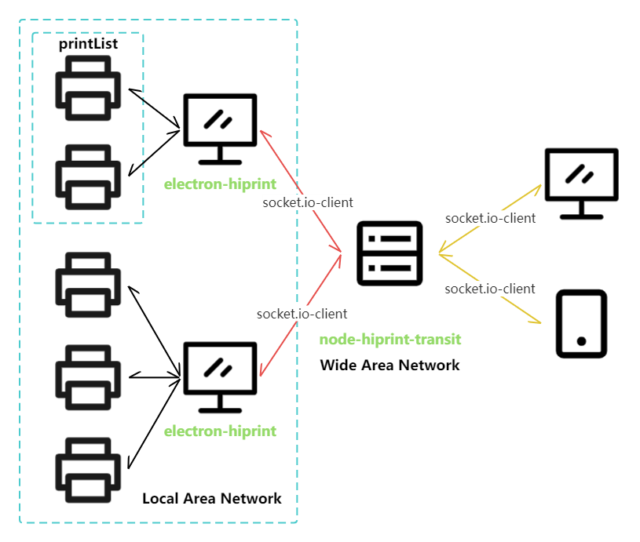

<a name="readme-top"></a>

# node-hiprint-transit

`node-hiprint-transit` is a Node.js server that acts as a middleman between the `electron-hiprint` client and the `vue-plugin-hiprint` library. It facilitates seamless connections and printing operations between these components over the internet.

[中文文档](README_CN.md)



## Features

- **Remote Printing**: Easily print documents from your client to a printer without pop-up dialogs using `electron-hiprint`.

- **Secure Connections**: All connections between the client, middleman server, and `vue-plugin-hiprint` library are secured with tokens and ports for enhanced security.

- **Configuration**: `node-hiprint-transit` allows you to configure various settings, including port, token, SSL usage, and language preferences.

## Initial Setup

Upon first usage, you'll need to perform an initial setup

This will install npm dependencies for you and walk you through the initial setup

```bash
npm run init

Set language 设置语言
en/zh(en): en # This will be set for guid and project
Set serve port 10000~65535(17521): 17521
Set service TOKEN(vue-plugin-hiprint): vue-plugin-hiprint
Set SSL on or off y/n (n): y # If you set on, you should install your ssl file
Configuration file written successfully
```

This command will install any necessary npm dependencies and launch the configuration wizard.

## Configuration

The configuration wizard will prompt you to set the following options:

- **lang**: Choose your preferred language (default: en).

- **port**: The port number to use for communication (default: 17521).

- **token**: A secure token (6 characters or more) for authentication (default: vue-plugin-hiiprint).

- **useSSL**: Enable or disable SSL for secure connections (default: false).

<p align="right"><a href="#readme-top">↑ back to top</a></p>

## Usage

### Run serve

```bash
npm run serve
# or
node index.js

Serve is running on
https://printjs.cn:17521

Please make sure that the ports have been opened in the security group or firewall.
token: vue-plugin-hiprint
```

### `Web` project connecting to `node-hiprint-transit`

Now, you can connect to `node-hiprint-transit` directly by specifying the middleman server's host and token:

```javascript
import { hiprint } from "vue-plugin-hiprint"

hiprint.init({
    host: "https://printjs.cn:17521", // Address and Port of your `node-hiprint-transit`
    token: "vue-plugin-hiprint",     // Token for authentication
});
```

<p align="right"><a href="#readme-top">↑ back to top</a></p>

### `electron-hiprint` connection to `node-hiprint-transit`

Right-click on the tray icon to access the settings and enter the server address, port, and token.


You can click `测试` to test the connect.

> connect success


> connect error


Finally `应用` and there will be restarted


<p align="right"><a href="#readme-top">↑ back to top</a></p>

## EVENTS

When a web client (vue-plugin-hiprint) connects, there will be `clients` and `printerList` events emitted.

### socket.on("getClients")
### socket.emit("clients", Object)

This will display information about all connected `electron-hiprint` clients.

```js
{
  "AlBaUCNs3AIMFPLZAAAh": {
    arch: "x64",
    clientUrl: "http://192.168.0.2:17521",
    ip: "192.168.0.2",
    ipv6: "fe80::13f:eb0f:e426:7c92",
    mac: "a1:a2:a3:a4:a5:a6",
    machineId: "12c90ff9-b9f4-4178-9099-9dd326b70c2e",
    platform: "win32",
    printerList: (6) [{
      description: "",
      displayName: "Microsoft Print to PDF",
      isDefault: true,
      name: "Microsoft Print to PDF",
      options: {,
        "printer-location": "",
        "printer-make-and-model": "Microsoft Print To PDF",
        "system_driverinfo": "Microsoft Print To PDF;10.0.19041.3570 (WinBuild.160101.0800);Microsoft® Windows® Operating System;10.0.19041.3570"
      },
      status: 0
    }, {…}, {…}, {…}, {…}, {…}],
    version: "1.0.7",
  },
  "clientid": {…},
  ...
}
```

### socket.on("refreshPrinterList")
### socket.emit("printerList", Array)

<p align="right"><a href="#readme-top">↑ back to top</a></p>

This will display information about all connected `electron-hiprint` client's printers.

```js
[{
  clientId: "AlBaUCNs3AIMFPLZAAAh",
  description: "",
  displayName: "Microsoft Print to PDF",
  isDefault: true,
  name: "Microsoft Print to PDF",
  options: {,
    "printer-location": "",
    "printer-make-and-model": "Microsoft Print To PDF",
    "system_driverinfo": "Microsoft Print To PDF;10.0.19041.3570 (WinBuild.160101.0800);Microsoft® Windows® Operating System;10.0.19041.3570"
  },
  status: 0
}, {…}, {…}, {…}, {…}, {…}]
```

### socket.on("clientInfo", (Object) => {})

Information of `electron-hiprint`.

### socket.on("printerList", (Array) => {})

For `electron-hiprint` emit client prints.

<p align="right"><a href="#readme-top">↑ back to top</a></p>

### socket.on("address")

Is not supported in transit server, you should use getClients.

### socket.on("ippPrint", (options) => {})

Make a ipp print to `electron-hiprint` client.

  - socket.emit("error", { msg })

  - socket.to(options.client).emit("ippPrint", { ...options, replyId: socket.id })

### socket.on("ippPrinterConnected", (options) => {})

Make a ipp printer connected event to reply client.

  - socket.to(options.replyId).emit("ippPrinterConnected", options.printer)

<p align="right"><a href="#readme-top">↑ back to top</a></p>

### socket.on("ippPrinterCallback", (options, res) => {})

Make a ipp printer callback to reply client.

  - socket.to(options.replyId).emit("ippPrinterCallback", options, res)

### socket.on("ippRequest", (options) => {})

Make a ipp request to `electron-hiprint` client.

  - socket.emit("error", msg)

  - socket.to(options.client).emit("ippRequest", { ...options, replyId: socket.id })

<p align="right"><a href="#readme-top">↑ back to top</a></p>

### socket.on("ippRequestCallback", (options, res) => {})

Make a ipp request callback to reply client.

  - socket.to(options.replyId).emit("ippRequestCallback", options, res)

### socket.on("news", (options) => {})

Make a news to `electron-hiprint` client.

  - socket.emit("error", {msg, templateId: options.templateId })

  - socket.to(options.client).emit("news", { ...options, replyId: socket.id })

<p align="right"><a href="#readme-top">↑ back to top</a></p>

### socket.on("success", (options) => {})

Make a success callback to reply client.

  - socket.to(options.replyId).emit("success", options)

### socket.on("error", (options) => {})

Make a error callback to reply client.

  - socket.to(options.replyId).emit("error", options)

<p align="right"><a href="#readme-top">↑ back to top</a></p>

## Something unimportant

1. `node-hiprint-transit` will log information in the `./logs` directory;

2. If you are using SSL, you should replace `./src/ssl.key` and `./src/ssl.pem`;

3. Every 10 minutes, it will retrieve the print list from `electron-hiprint`.

<p align="right"><a href="#readme-top">↑ back to top</a></p>