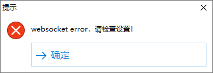

<a name="readme-top"></a>

# node-hiprint-transit

`node-hiprint-transit` 是一个基于 Node.js 的中转服务器，用于在 `electron-hiprint` 客户端和 `vue-plugin-hiprint` 库之间充当中转服务，实现这些组件之间的无缝连接和打印操作。

[English](README.md)


## 特点

- **远程打印**: 使用 `electron-hiprint` 轻松将文档从客户端打印到打印机，无需弹出对话框。

- **安全连接**: 客户端、中转服务器和 `vue-plugin-hiprint` 库之间的所有连接都使用令牌和端口进行安全保护。

- **配置**: `node-hiprint-transit` 允许您配置各种设置，包括端口、令牌、是否使用 SSL 和语言首选项。

## 脚本

这个脚本将帮助你快速安装、初始化、运行 `node-hiprint-transit`。

```bash
wget https://raw.githubusercontent.com/Xavier9896/node-hiprint-transit/main/install.sh

chmod +x install.sh

./install.sh
```

## 初始化设置

首次使用时，您需要执行初始设置

这将会为你安装 npm 依赖，并且一步步引导你初始化

```bash
npm run init

Set language 设置语言
en/zh(en): zh # 这将设置为接下来的引导与项目语言
设置服务端口号10000~65535(17521)：17521
设置服务 TOKEN(vue-plugin-hiprint)：vue-plugin-hiprint
设置开启 SSL y/n (n)：n # 如果你设置为开启，你将需要安装你的 ssl 证书
配置文件写入成功
```

此命令将安装必要的 npm 依赖项并启动配置向导。

## 配置

配置向导将提示您设置以下选项：

- **语言**: 选择您的首选语言（默认：en）。

- **端口**: 通信使用的端口号（默认：17521）。

- **令牌**: 用于身份验证的安全令牌（6 个或更多字符）（默认：vue-plugin-hiiprint）。

- **SSL**: 启用或禁用安全连接的 SSL（默认：false）。

<p align="right"><a href="#readme-top">↑ 回到顶部</a></p>

## 使用方法

### 启动服务

```bash
npm run serve
# or
node index.js

服务器正运行在
https://printjs.cn:17521

请确保安全组或防火墙已放行端口。
令牌：vue-plugin-hiprint
```

### `Web` 项目连接 `node-hiprint-transit`

现在你可以直接使用服务器地址及token连接中转服务 `node-hiprint-transit`

```javascript
import { hiprint } from 'vue-plugin-hiprint'

hiprint.init({
    host: 'https://printjs.cn:17521', // 此处输入服务启动后的地址
    token: 'vue-plugin-hiprint',     // 用于鉴权的token
});
```

<p align="right"><a href="#readme-top">↑ 回到顶部</a></p>

### `electron-hiprint` 连接到 `node-hiprint-transit`

右键单击托盘图标以访问设置并输入服务器地址、端口和令牌。


输入完毕后你可以点击 `测试` 检查是否能够正常连接。

> 连接成功


> 连接失败



最后 `应用` 重启即可


<p align="right"><a href="#readme-top">↑ 回到顶部</a></p>

## EVENTS

当 Web 客户端（vue-plugin-hiprint）连接时，将发出 `clients` 和 `printerList` 事件。

### socket.on("getClients")
### socket.emit("clients", Object)

这将显示所有连接的 `electron-hiprint` 客户端的信息。

```js
{
  "AlBaUCNs3AIMFPLZAAAh": {
    arch: "x64",
    clientUrl: "http://192.168.0.2:17521",
    ip: "192.168.0.2",
    ipv6: "fe80::13f:eb0f:e426:7c92",
    mac: "a1:a2:a3:a4:a5:a6",
    machineId: "12c90ff9-b9f4-4178-9099-9dd326b70c2e",
    platform: "win32",
    printerList: (6) [{
      description: "",
      displayName: "Microsoft Print to PDF",
      isDefault: true,
      name: "Microsoft Print to PDF",
      options: {,
        "printer-location": "",
        "printer-make-and-model": "Microsoft Print To PDF",
        "system_driverinfo": "Microsoft Print To PDF;10.0.19041.3570 (WinBuild.160101.0800);Microsoft® Windows® Operating System;10.0.19041.3570"
      },
      status: 0
    }, {…}, {…}, {…}, {…}, {…}],
    version: "1.0.7",
  },
  "clientid": {…},
  ...
}
```

### socket.on("refreshPrinterList")
### socket.emit("printerList", Array)

<p align="right"><a href="#readme-top">↑ 回到顶部</a></p>

这将显示所有连接的 `electron-hiprint` 客户端的打印机信息。

```js
[{
  clientId: "AlBaUCNs3AIMFPLZAAAh",
  description: "",
  displayName: "Microsoft Print to PDF",
  isDefault: true,
  name: "Microsoft Print to PDF",
  options: {,
    "printer-location": "",
    "printer-make-and-model": "Microsoft Print To PDF",
    "system_driverinfo": "Microsoft Print To PDF;10.0.19041.3570 (WinBuild.160101.0800);Microsoft® Windows® Operating System;10.0.19041.3570"
  },
  status: 0
}, {…}, {…}, {…}, {…}, {…}]
```

### socket.on("clientInfo", (Object) => {})

`electron-hiprint` 的信息。

### socket.on("printerList", (Array) => {})

向 `electron-hiprint` 发出客户端打印。

<p align="right"><a href="#readme-top">↑ 回到顶部</a></p>

### socket.on("address")

不支持该 api，应该使用 getClients。

### socket.on("ippPrint", (options) => {})

向 `electron-hiprint` 客户端进行 IPP 打印。

  - socket.emit("error", { msg })

  - socket.to(options.client).emit("ippPrint", { ...options, replyId: socket.id })

### socket.on("ippPrinterConnected", (options) => {})

创建 IPP 打印机连接事件以回复客户端。

  - socket.to(options.replyId).emit("ippPrinterConnected", options.printer)

<p align="right"><a href="#readme-top">↑ 回到顶部</a></p>

### socket.on("ippPrinterCallback", (options, res) => {})

进行 IPP 打印机回调以回复客户端。

  - socket.to(options.replyId).emit("ippPrinterCallback", options, res)

### socket.on("ippRequest", (options) => {})

向 electron-hiprint 客户端发出 IPP 请求。

  - socket.emit("error", msg)

  - socket.to(options.client).emit("ippRequest", { ...options, replyId: socket.id })

<p align="right"><a href="#readme-top">↑ 回到顶部</a></p>

### socket.on("ippRequestCallback", (options, res) => {})

进行 IPP 请求回调以回复客户端。

  - socket.to(options.replyId).emit("ippRequestCallback", options, res)

### socket.on("news", (options) => {})

向 electron-hiprint 客户端发送打印信息。

  - socket.emit("error", {msg, templateId: options.templateId })

  - socket.to(options.client).emit("news", { ...options, replyId: socket.id })

<p align="right"><a href="#readme-top">↑ 回到顶部</a></p>

### socket.on("success", (options) => {})

进行成功回调以回复客户端。

  - socket.to(options.replyId).emit("success", options)

### socket.on("error", (options) => {})

进行错误回调以回复客户端。

  - socket.to(options.replyId).emit("error", options)

<p align="right"><a href="#readme-top">↑ 回到顶部</a></p>

## 一些不重要的信息

1. `node-hiprint-transit` 将会记录日志信息于 `./logs` 这个目录；

2. 如果你开启了 SSL，你应该替换 `./src/ssl.key` 和 `./src/ssl.pem` 这两个文件；

3. 每10分钟会向 `electron-hiprint` 请求一次打印机列表。

<p align="right"><a href="#readme-top">↑ 回到顶部</a></p>

### 如果该项目对你有所帮助，请给我一个 star，谢谢！

